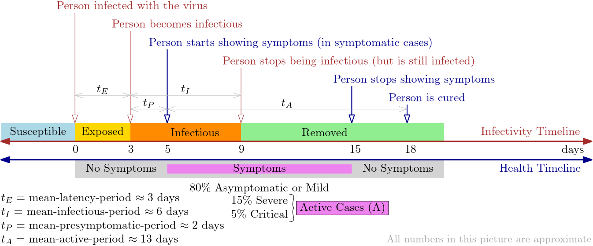
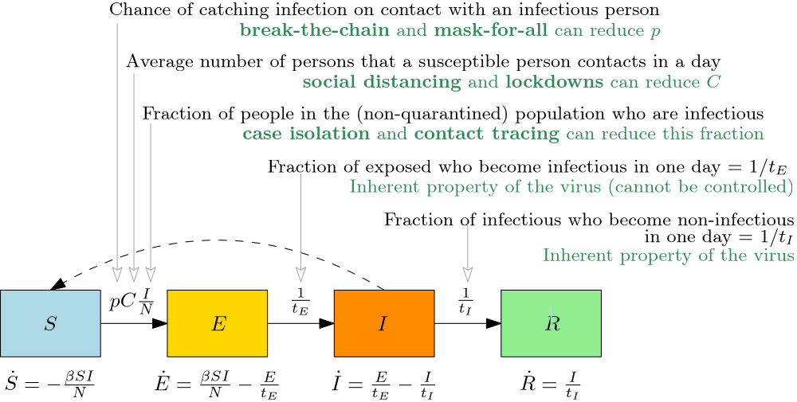

The *covidsim.in* simulator combines two standard mathematical models -- the
SEIR model for epidemic time evolution and the Gravity Model for movement of
people between regions for daily work. Each Local Self Government (LSG)
division (grama panchayath, municipality or municipal corporation) in Kerala
is treated as a separate region. So we have 1035 regions in total -- 941 grama
panchayaths, 87 municipalities, 6 municipal corporations and Mahe treated as a
separate region.  A separate SEIR evolution is run for each region with number
of people equal to the population of that region as per 2011 census. These 1035
SEIR evolutions are coupled by cross-infections through people travelling for
daily work between regions. Since we do not have direct data on the number of
people travelling between two regions, we assume those numbers using a simple
Gravity Model that is fairly common in transportation studies. The details of
each of the models and their coupling is given in the following sections. We
also describe how we model the effect of various mitigation strategies like
break-the-chain, complete lockdown, district boundary closures, dynamic
hotspots, dynamic red/orange/green zones etc.

# Timeline of the virus and the SEIR Model

A person gets infected by SARS-CoV-2 (Covid-19) virus when she comes in contact
(either directly or via a shared surface) with an infectious person. A fraction
of such people will start showing symptoms within 2 to 14 days (average 5.2
days) and the symptoms will typically last for around 10 days. This is called
as the *health timeline* in the figure below. But what matters more for
modelling is the *infectivity timeline*, which is the period during which an
infected person is infectious or contagious. This period is estimated to start
typically from about 1 to 2 days before the onset of symptoms and lasts
typically for about 6 days. This period is marked as $I$ (Infectious) in the
infectivity timeline. The period before that, starting from the day of contact
is marked as $E$ (Exposed or Latent). This is when the virus is multiplying in
her body but is still not numerous enough to be infectious. The period after
$I$ is marked as $R$ (Removed). This is when she is no longer infectious. She
might still have symptoms at this stage and will typically take another 8 or
more days to be cured. Note that the word "typically" is intentionally overused
in this paragraph. All these timelines vary from person to person depending on
their health conditions and viral load transmitted at contact. 

The SEIR model of disease spread is based on the infectivity timeline above.
It considers the total population $N$ in a region as being split
into four compartments based on their stage of infection. The number of people
in each compartment change with time but they always add to $N$.

The time evolution of the sizes of these four compartments is modelled by
the following four ordinary differential equations.

$$
\begin{aligned}
\dot S	 &= -\beta S \frac{I}{N} \\
\dot E	 &= \beta S \frac{I}{N} - \frac{E}{t_E}\\
\dot I	 &= \frac{E}{t_E} - \frac{I}{t_I}\\
\dot R	 &= \frac{I}{t_I}
\end{aligned}
$$

Here 

-	$\beta = p C$, where
	-	$p$ is the probability that a susceptible person who contacts an
		infectious person catches the disease (not all contacts transmit the
		disease)

	-	$C$ is the expected number of people that a susceptible person contacts
		in a day. 

		Going further we will have to model it as $C = C_h + C_w$,
		where $C_h$ and $C_w$ are the expected number of people that a
		susceptible person contacts at home and work/school respectively.

	-	$C \frac{I}{N}$ therefore, is the expected number of infectious
		people that a susceptible person contacts in a day.

	-	$p C \frac{I}{N}$ therefore, is the probability that that a
		susceptible person catches the disease in a day.

-	$t_E$ is the mean time that a person spends in compartment $E$. That is,
	the typical time from contact of the virus till the person starts becoming
	infectious (contagious)

-	$t_I$ is the mean time that a person spends in compartment $I$. That is,
	the typical time a person remains infectious (contagious).

- 	The time variable is hidden in the above equations for readability. For
	example,  $S$ should be read as $S(t)$ and $\dot S$ should be read as
	$\frac{d}{dt}S(t)$.  

# Spatial mixing 

We say that a person *travels* from region $R_i$ to region $R_j$, if she lives
in $R_i$ but goes daily to $R_j$ for work. We will assume that there are $r$
regions in total. Let us denote by $T_{i,j}$, the number of people travelling
for work from region $R_i$ to region $R_j$ in a day. How fast an epidemic
spreads over various regions depends mainly on these numbers. Unfortunately, we
do not have actual estimates for these numbers. Hence we use a commonly used
mathematical model called the *gravity model* to artificially estimate  these
numbers.

## Travel matrix $T$ from Gravity model

The gravity model needs three inputs, some of which we indirectly modelled
using the population statistics. We denote the population of region $R_i$ with
$N_i$.

1.	$T_i$, the number of people who travel out from region $R_i$ every day. We
	need this for for every LSGD in the state. In the absence of direct
	estimates, we assume $T_i$ indirectly from the 2011 census data as follows.

	Census 2011 contains a histogram of daily travel distances of
	non-agricultural workers at district level resolution. Since the histogram
	is coarse and there is no huge variation across districts, we estimate
	$T_i$ as $T_i = \mu N_i$, where 
  	-	$\mu = 0.09$ for regions with area less than $25$ square kilometers
	-	$\mu = 0.04$ for regions with area between $25$ and $100$ square
		kilometers
	-	$\mu = 0.02$ for regions with area more than $100$ square kilometers

	The values 9%, 4% and 2% used above are based, respectively, on the 2011
	census estimate of the percentage of population travelling more than $5$,
	$10$ and $20$ kilometers for work (Kerala overall statistics).

2. 	$J_j$ is the number of non-agricultural job opportunities in $R_j$. We need
	this too for every LSGD. It will be great if one can find these numbers
	from a primary source. In the absence of such a source, we model it as $J_j
	= \zeta N_j$, where 
	- $\zeta = 0.1$ for grama panchayats,
	- $\zeta = 0.2$ for municipalities and 
	- $\zeta = 0.3$ for corporations

	*Notes.* Only the relative magnitudes of the three zeta's matter. We
	consider only non-agricultural jobs, since census data considers that
	agricultural sector jobs has very little contribution to long-distance
	(more than 5 km) daily commuting.

3.	$d_{i,j}$ is the distance between regions $R_i$ and $R_j$. We need this for
	every pair of LSGDs. We use the aerial distance between the centers of 
	the region calculated from an LSG level GIS map of Kerala.

Using these three inputs, we model the number of people $T_{i,j}$ travelling
for work from region $R_i$ to region $R_j$ in a day is as

$$
T_{i,j} = \alpha_i \frac {T_i J_j}{d_{i,j}^2}.
$$
where the normalisation factor 
$$
\alpha_i = \left(\sum_{k \neq i}(J_k/d_{i,k}^2)\right)^{-1}.
$$

We assume the dependence on the distance to be $T_{i,j} \propto 1/d_{i,j}^2$.
This dependence is usually calibrated based on real data of job movement in a
region. In the absence of such data for Kerala, we are making an arbitrary
choice here based on a subjective validation of the results.

Putting it all together in one formula, we get

$$
T_{i,j} = T_i \frac{(J_j/d_{i,j}^2)}{\sum_{k \neq i}(J_k/d_{i,k}^2)},~ \forall j \neq i,
$$
and then compute $T_{i,i} = N_i - T_i$, the number of people in region $R_i$
who work/stay in $R_i$ itself. So if there are $r$ regions in total, all
these $T_{i,j}$ values are arranged as an $r \times r$ matrix $T$.

##	Normal Workplace Contact matrix $W_N$

The *Normal Workplace Contact Matrix* $W_N$ is an $r \times r$ matrix in which
the entry $W_N[i,j]$ is the expected number of people from region $R_j$ that a
susceptible person from region $R_i$ will contact at workplace/school during a
*normal day*. We will scale this matrix appropriately for non-normal days, that
is days in which any mitigation strategy is active. We model $W_N$ as a
function of the population statistics and the travel matrix.

$$
W_N[i,j] = C_w \sum_{k=1}^{r} \frac{T_{i,k}}{N_i} \frac{T_{j,k}}{\sum_{l=1}^{r} T_{l,k}},
$$
where

-	$C_w$ is the expected number of people that a susceptible person contacts
	at work/school on a normal day,

-	$N_i$ is the population of region $R_i$, and

-	$T_{i,j}$ is the expected number of people travelling for work from region
	$R_i$ to region $R_j$ on a normal day.

*Justification.* If we consider a person picked uniformly at random from region
$R_i$, the term $T_{i,k} / N_i$ can be interpreted as the probability that she
goes for work in region $R_k$ and the term $T_{j,k} / \sum_{l=1}^{r} T_{l,k}$
can be interpreted as the probability that a person she contacts at workplace
(while at work in region $R_k$) has come to work there from region $R_j$.
Notice that the total number of people in region $R_k$ during the day is not
$N_k$ but $\sum_{l=1}^{r} T_{l,k}$. Since we have chosen $T_{k,k}$ as $N_k -
T_k$, this sum will automatically account for the people who live and work in
$R_k$.

## Mitigated Workplace Contact Matrix $W_M$

The *mitigated workplace contact matrix* $W_M$ is a function of the normal
workplace contact matrix $W_N$ and the various mitigation strategies like
break-the-chain, lockdowns, hotspots etc that are active in the state on a day.
The entry $W_M[i,j]$ will represent the expected number of people from region
$R_j$ that a susceptible person from region $R_i$ will contact at
workplace/school during a day when all the active mitigation strategies are in
place.

The effect of a containment mitigation strategy like lockdown, hotspot, red
zone and orange zone in a region $R_i$  is mathematically treated as a scaling
down of the values $W_N[i,j]$ and $W_N[j,i]$ (for all $j$) by fractions
$\epsilon_{LD}$, $\epsilon_{HS}$, $\epsilon_{RZ}$, and $\epsilon_{OZ}$
respectively. District border closure is mathematically treated as a scaling
down of contacts between different districts by a fraction $\epsilon_{DB}$.  If
multiple containment strategies are in place at the same time, then the
scale-down factor selected is the one for the strongest strategy. The effect of
social distancing mitigation strategies like break-the-chain is modelled as a
further scale down of the above $W_N[i,j]$ values by a fraction
$\epsilon_{BC}$. (See the last section for default values of all these
fractions). The matrix with these scaled down entries is called $W_M$, the
mitigated workplace contact matrix.

## Effective Contact Matrix $C$

The *Effective Contact Matrix* $C$ is obtained from the mitigated workplace
contact matrix $W_M$ by adding expected number of daily household contacts
$C_h$ to each diagonal entry of $W_M$. This is justified since all household
contacts happen in the region of a person's living. Moreover, we assume that no
mitigation strategy is effective in reducing the household transmission of
infection.

$$
\begin{aligned}
C[i,j] &= W_M[i,j], i \neq j, \\
C[i,i] &= W_M[i,i] + C_h.
\end{aligned}
$$

# Putting it all together - Spatio-Temporal Evolution

Finally we put all these together to form a four ordinary differential
equations per region. The first two equations for each region contain terms
from other regions too.

$$
\begin{aligned}
\dot S_i &= -p S_i \sum_{j=1}^{n} C_{i,j} \frac{I_j}{N_j} \\
\dot E_i &=  p S_i \sum_{j=1}^{n} C_{i,j}\frac{I_j}{N_j} - \frac{E_i}{t_E} \\
\dot I_i &=	 \frac{E_i}{t_E} - \frac{I_i}{t_I}\\
\dot R_i &=	 \frac{I_i}{t_I}
\end{aligned}
$$

The variables $p$, $t_E$ and $t_I$ are the same as those for the simple SEIR
model described in the beginning.  In the simulator we discretise the above by
assuming that time advances in steps of one day, and hence treat $\dot S_i$ as
the daily increment to $S_i$. That is,  $\dot S_i = S_i(t+1) - S_i(t)$. Our
simulator starts with the initial states of each variable, $S_i(0)$ , $E_i(0)$,
$I_i(0)$ and $R_i(0)$ and then updates it according to the above increment
rules.

# Initialisation

Currently we are doing a very simple initialisation by adding the seed numbers
of infectious people entered by the user directly to Compartment $I$ and
keeping the $E$ and $R$ compartments empty. While this is a natural thing to do
in a simulator, we remark that this is not a very realistic scenario once the
epidemic has started spreading.

# Default parameter values

## SEIR model

These parameter values can be changed by an user using the advanced controls.

Parameter  | Value       | Description
---------: | :------     | :----
$p$        | 0.02        | Probability of infection per contact
$C_h$      | 5	persons  | Mean contacts per day in households
$C_w$      | 15 persons  | Mean contacts per day in workplace
$t_E$      | 3 days      | Mean latent period
$t_I$      | 6 days      | Mean latent period

## Mitigation effects

These parameter values can be changed by an user using the advanced controls.

 Multiplier      Value    Mitigation strategy
-----------      ------   ----
$\epsilon_{BC}$  2/3      Break-the-chain
$\epsilon_{LD}$  1/3      Complete Lockdown
$\epsilon_{DB}$  1/3      District Border Closure
$\epsilon_{RZ}$  1/3      Red Zone
$\epsilon_{OZ}$  1/3      Orange Zone
$\epsilon_{HS}$  1/4      Hotspot
$n_{HS}$		 1 case   Minimum number of active reported cases
						  to declare a region as a hotspot
$n_{RZ}$		 10 cases Minimum number of active reported cases
						  to declare a district as a red zone
$a_R$			 1   	  Fraction of infectious cases 
						  getting reported and confirmed
$d_R$			 5 days   Mean delay in an infectious case
						  getting reported and confirmed
$d_{HS}$		 7 days	  Minimum number of days a region will remain
						  as a hotspot once it becomes one
$d_{RZ}$		 7 days   Minimum number of days a district will remain
						  as a red zone once it becomes one
$d_{GZ}$		 21 days  Number of days with no new infections reported
						  so that a district can become a green zone again

## Gravity Model

Currently these parameters cannot be changed for the simulator. This is because
we pre-compute and store the travel matrix to save a lot of repeated computation.

 Parameter  Value       Description
----------  ------      ------------
$\eta$      2           Distance exponent in Gravity model
$A_S$       25 sq.km.   Area up to which an LSG is treated as small
$A_L$       100 sq.km.  Area above which an LSG is treated as large
$\mu_S$     0.09        Fraction of population who travel out for work
		   			    from a small LSG
$\mu_M$     0.04        Fraction of population who travel out for work
						from a medium LSG
$\mu_L$     0.02        Fraction of population who travel out for work
						from a large LSG
$\zeta_P$   0.1         Jobs per person in a panchayath
$\zeta_M$   0.2         Jobs per person in a municipality
$\zeta_C$   0.3         Jobs per person in a corporation

