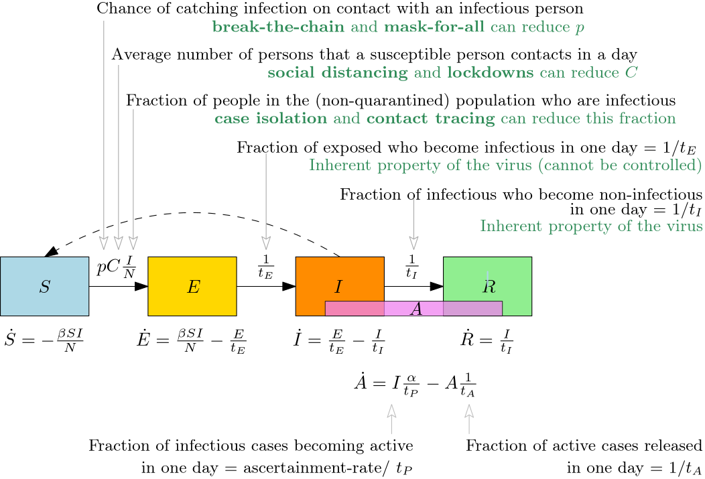

# Aim

To build a spatio-temporal simulator that can predict the spread of Covid-19 in
Kerala under different mitigation strategies. We hope that this will be useful
for experts in community health to corroborate their intuition against a mathematical prediction. 

# Key features

1.	The resolution of the model is at the smallest local self-governing
	division (LSGD) in Kerala.  That is, grama panchayat, municipality or
	municipal corporation. 

2. 	The predictions are  based on available information about the
	characteristics of the disease, the geographic and demographic data of
	Kerala and the statistics of reported cases so far. 

3. 	The time evolution of the disease in each LSGD is modelled using a
	deterministic [SEIR model](https://en.wikipedia.org/wiki/Compartmental_models_in_epidemiology#The_SEIR_model)
	fine-tuned for Covid-19.

4. 	The mixing of population between panchayats is based on the [*gravity
	model* for human mobility](https://en.wikipedia.org/wiki/Gravity_model_of_migration)

5. 	Spatio-temporal effect of various lockdown strategies can be tried out by
	the user. Some examples of lockdown strategies include
	(a) Lockdown a panchayat for $d$ days if there are more than $c$ active
		cases in that panchayat.  
	(b) Lockdown a panchayat and its neighbouring panchayats for $d$ days if
		there are more than $c$ active cases in that panchayat.

6.	A lockdown strategy will be declared as *safe* if the demand for number of
	cases needing hospitalisation is within the capacity of the corresponding
	LSGD at every point in time. Other strategies will be declared as *unsafe*.
	A quality parameter will be reported for each safe strategy tried. The
	quality parameter is equal to the average number of working days
	(non-lockdown days) per person for the next year. 

7. 	The system will automatically try out various lockdown strategies in the
	backend and provide a small set of safe strategies which acheive high
	values for the above quality parameter.

# User interface

1.	A web dashboard like [Covid19-Scenarios](https://covid19-scenarios.org/)
	with added map-based animations like
	[OurWoldInData](https://ourworldindata.org/grapher/total-covid-deaths-per-million)
	for projected data.

2. 	The user can try out the effect of various spatio-temporal lockdown
	strategies like those available in
	[CovidMeasures](https://covid-measures.github.io/)

3.	A discussion forum (not sure if it is needed or not)

4.	A logging of crowd-sourced high quality strategies (again, not sure)

# Time evolution (SEIR Model)

A person gets infected by SARS-CoV-2 (Covid-19) virus when she comes in contact
(either directly or via a shared surface) with an infectious person. A fraction
of such people will start showing symptoms within $2$ to $14$ days (average
$5.2$ days) and the symptoms will typically last for around $10$ days. This is
called as the *health timeline* in the figure below. But what matters more for
modelling is the *infectivity timeline*, which is the period during which an
infected person is infectious or contagious. This period is estimated to start
typically from about $1$ to $2$ days before the onset of symptoms and lasts
typically for about $7$ days. This period is marked as $I$ (Infectious) in the
infectivity timeline. The period before that, starting from the day of contact
is marked as $E$ (Exposed or Latent). This is when the virus is multiplying in
her body but is still not numerous enough to be infectious. The period after
$I$ is marked as $R$ (Removed). This is when she is no longer infectious. She
might still have symptoms at this stage and will typically take another $8$ or
more days to be cured. Note that the word "typically" is intentionally overused
in this paragraph. All these timelines vary from person to person depending on
their health conditions and viral load transmitted at contact. The numbers
reported are averages picked from most WHO reports.

The SEIR model of disease spread is based on the infectivity timeline above.
It considers the total population $N$ in a region as being split
into four compartments based on their stage of infection. The number of people
in each compartment change with time but they always add to $N$.

## Temporal evolution equations

$$
\begin{aligned}
\dot S_i	 &= -\beta S_i \frac{I_i}{N_i} \\
\dot E_i	 &= \beta S_i \frac{I_i}{N_i} - \frac{E_i}{t_E}\\
\dot I_i	 &= \frac{E_i}{t_E} - \frac{I_i}{t_I}\\
\dot R_i	 &= \frac{I_i}{t_I}\\
\end{aligned}
$$

Here 

-	$\beta = \pi c$, where
	-	$\pi$ is the probability that a susceptible person who contacts an
		infectious person catches the disease (not all contacts transmit the
		disease)

	-	$c$ is the expected number of people that a susceptible person contacts
		in a day. Going further we will have to model it as $c = c_h + c_w$,
		where $c_h$ and $c_w$ are the expected number of people that a
		susceptible person contacts at home and work/school respectively.

	-	$c \frac{I_i}{N_i}$ therefore, is the expected number of infectious
		people that a susceptible person contacts in a day.

	-	$\pi c \frac{I_i}{N_i}$ therefore, is the probability that that a
		susceptible person catches the disease in a day.

-	$t_E$ and  $t_I$ are the mean time that a person spends in the respective
	compartments, before moving onto the next.

-	The time variable is hidden in the above equations for readability.
	$S_i$ should be read as $S_i(t)$ and $\dot S$ should be read as
	$S(t+1) - S(t)$, and so on.

## Current parameter choices

-	$\pi \approx 0.02$, this can reduce with the use of masks and regular
	cleansing.
-	$c_h \approx 5$
-	$c_w$ is typically 15 on a normal day and 0 on a lockdown day.
-	$t_E \approx 3$
-	$t_I \approx 7$

# Spatial mixing 

We say that a person *travels* from region $R_1$ to region $R_2$, if she lives
in $R_1$ but works mostly in $R_2$. We will assume that there are $r$ regions
in total.

## Gravity model

The number of people $T_{i,j}$ travelling for work from region $R_i$ to region
$R_j$ in a day is modelled as

$$
T_{i,j} = T_i \frac {N_i J_j}{d_{i,j}^2},
$$
where

- $N_i$ is the population of region $R_i$.

- $J_j$ is the number of non-agricultural job opportunities in $R_j$. It will
  be great if one can find these numbers from a primary source. In the absence
  of such a source, we model it as $J_j = \zeta N_j$, where 
	- $\zeta = 0.1$ for grama panchayats,
	- $\zeta = 0.2$ for municipalities and 
	- $\zeta = 0.3$ for corporations

  *Notes.* Only the relative magnitudes of the three zeta's matter. We consider
  only non-agricultural jobs, since census data considers that agricultural
  sector jobs has very little contribution to long-distance (more than 5 km)
  daily commuting.

- $d_{i,j}$ is the travel distance between regions $R_i$ and $R_j$.

  The dependence on the distance is assumed to be $T_{i,j} \propto
  1/d_{i,j}^2$.  This dependence is usually calibrated based on real data of
  job movement in a region. In the absence of such data for Kerala, we are
  making an arbitrary choice here based on a subjective validation of the
  results.

- We can estimate the proportionality constant using the relation
  $$ T_i = \sum_{j \neq i} T_{i,j},$$
  where $T_i$ is the total number of people who travel out for work from region
  $R_i$.  Census 2011 contains a histogram of daily travel distances of
  non-agricultural workers at district level resolution. Since the histogram is
  coarse and there is no huge variation across districts, we estimate $T_i$ as
  $T_i = \mu N_i$, where 
  -	$\mu = 0.09$ for regions with area less than $25$ square kilometers
  -	$\mu = 0.04$ for regions with area between $25$ and $100$ square kilometers
  -	$\mu = 0.02$ for regions with area more than $100$ square kilometers

  The values 9%, 4% and 2% used above are based, respectively, on the 2011
  census estimate of the percentage of population travelling more than $5$, $10$
  and $20$ kilometers for work (Kerala overall statistics).

- Putting it all together,
  $$
  T_{i,j} = T_i \frac{(J_j/d_{i,j}^2)}{\sum_{k \neq i}(J_k/d_{i,k}^2)},~ \forall j \neq i,
  $$
  and then compute $T_{i,i} = N_i - \sum_{j \neq i} T_{i,j}$. Theoretically
  $T_{i,i}$ should be $N_i - T_i$, but I'm seeing rounding errors creeping in.

*Optimisation notes.* 

- It is better to compute the $T_i$ and $J_i$ arrays first rather than
  computing it as $\mu N_i$ and $\zeta N_i$ inside the nested loops.  	

- It might be fastest to compute $T_{i,j}$ values as a $r \times r$ matrix in
  three stages.
  1. Fill a matrix $A$ with $A[i,j] = J_j/d_{i,j}^2$ for $j \neq i$ and $0$ for
	 $j = i$.
  2. Divide each row of $A$ by the sum of that row so that finally each row
	 sums to $1$.
  3. Multiply each row of $A$ with $T_i$ to get the $T_{i,j}$ matrix (except
	 the diagonal entries)
  4. Set the diagonal entries $T_{i,i}$ as $N_i$ minus the sum of $i$-th
     row of the $T_{i,j}$ matrix obtained in the previous step.
  

  

#	Travel Matrix to Contact Matrix

1.	**Workplace Contact Matrix.** 
	This is an $r \times r$ matrix $C_w$ in which the entry $C_w[i,j]$ is 
	the expected number of people from region $R_j$ that a susceptible person
	from region $R_i$ will contact at workplace/school in a day. We model
	it as

	$$
	C_w[i,j] = c_w \sum_{k=1}^{r} \frac{T_{i,k}}{N_i} \frac{T_{j,k}}{\sum_{l=1}^{r} T_{l,k}}
	$$

	If you consider a person picked uniformly at random from region $R_i$, the
	term $\frac{T_{i,k}}{N_i}$ can be interpretted as the probability that she
	goes for work in region $R_k$ and the term	$\frac{T_{j,k}}{\sum_{l=1}^{r}
	T_{l,k}}$ can be interpretted as th probability that a person she contacts
	at workplace (in region $R_k$) has come to work there from region $R_j$.
	Notice that the total number of people in region $R_k$ during the day is
	not $N_k$ but $\sum_{l=1}^{r} T_{l,k}$. Since we have chosen $T_{k,k}$ as
	$N_k - T_k$, this sum will account for the people leaving and entering
	$R_k$ for work.

2.	**Contact Matrix.**
	The contact matrix $C$ is obtained by adding $c_h$ to each diagonal
	entry of $C_w$. This is justified since all household contacts happen
	in the region of a person's living.

# Spatio-Temporal Evolution

$$
\begin{aligned}
\dot S_i &= -\pi S_i \sum_{j=1}^{n} C_{i,j} \frac{I_j}{N_j} \\
\dot E_i &=  \pi S_i \sum_{j=1}^{n} C_{i,j}\frac{I_j}{N_j} - \frac{E_i}{t_E} \\
\dot I_i &=	 \frac{E_i}{t_E} - \frac{I_i}{t_I}\\
\dot R_i &=	 \frac{I_i}{t_I}
\end{aligned}
$$

The sum $\sum_{j=1}^{n} C_{i,j} \frac{I_j}{N_j}$ can be implemented
as a matrix-vector multiplication if that will speed up the code.

# Modelling Mitigation strategies

## Mitigation strategies to be included in v0.1

1.	Break the Chain + Mask 
	- Only text message
	- $\pi \rightarrow \epsilon_{BC} \times \pi$ from March 16, 2020

2.	Complete Lockdown 
	- Date Range
	- $c_w \rightarrow \epsilon_{LD} c_w$ during the lockdown date ranges

3.	District Border Closure
	- Date Range
	- $C_w[i,j] \rightarrow \epsilon_{DB} C_w[i,j]$, if $R_i$ and $R_j$ 
	  are regions from two different districts.

4.	Predefined Hotspots
	- Upload csv of current hotspots, with date range for each (name clash?)
	- To simulate lockdown of one region $R_i$, set 
		- $C_w[i,j] \rightarrow \epsilon_{HS} C_w[i,j]$, for all $j$, and
		- $C_w[j,i] \rightarrow \epsilon_{HS} C_w[j,i]$, for all $j \neq i$

	  during the selected date range.
	- Repeat this for every region in the list of hotspots.
	- Notice that if both $R_i$ and $R_j$ are under lockdown, $C_w[i,j]$ will
	  get scaled by $\epsilon_{HS}^2$, which agrees with the transportation
	  model.

5.	Dynamic Hotspots
	- Any LSGD with an active case is declared as a hotspot for the next $7$
	  days or till the number of active cases goes below $0.5$, whichever
	  is later. 
	- A lockdown is simulated as in the previous case.

6.	Red Zone
	- 14 checkboxes | Visual select from map
	- Date Range
	- For every region $R_i$ in the red zone, set 
		- $C_w[i,j] \rightarrow \epsilon_{RZ} C_w[i,j]$, for all $j$, and
		- $C_w[j,i] \rightarrow \epsilon_{RZ} C_w[j,i]$, for all $j \neq i$

	  during the selected date range.

7.	Orange Zone
	- 14 checkboxes | Visual select from map
	- Date Range
	- Simlulation is same as red zone but with $\epsilon_{OZ}$ instead of
	  $\epsilon_{RZ}$.

where, 

- $\epsilon_{BC} = 2/3$,
- $\epsilon_{DB} = 1/5$,
- $\epsilon_{OZ} = 1/5$,
- $\epsilon_{RZ} = 1/10$,
- $\epsilon_{LD} = 1/10$,
- $\epsilon_{HS} = 1/50$

## Scenarios

1.	Initialise with today's reality

2.	Initialise with a past reality and validate against today's reality.
	- Is it agreeing at state/district level?

# Justifying the model and parameter choices

## Team

- Arun Ramachandran
- Birenjith P. S.
- Deepak R.
- Sajith V. K.
- Sreeram H.

### Acknowledgements

- Dr. B. K. Bhavathrathan, Assistant. Professor, Civil Engineering, IIT Palakkad.

\clearpage

# Tried and ruled out 

## Radiation model

The number of people $T_{i,j}$ travelling from region $R_i$ to region $R_j$ on
a working day is modelled as

$$
T_{i,j} = T_i \frac {J_i J_j}{(J_i + S_{i,j})(J_i + J_j + S_{i,j})},
$$
where 

- $J_i$ is the number of job opportunities in $R_i$. It will be great if one
  can find these numbers from a primary source. In the absence of such a
  source, we model it as $J_i = \zeta N_i$, where 
	- $N_i$ is the population of $R_i$
	- $\zeta = 0.1$ for grama panchayats,
	- $\zeta = 0.2$ for municipalities and 
	- $\zeta = 0.3$ for corporations

  (Only the relative magnitudes of the three zeta's matter)

- $T_i$ is the total number of people who travel out for work from region
  $R_i$.  At a larger granularity, this data for each region may be available
  from Census.  Otherwise, one can model it as $T_i = \mu N_i$, where
  -	$\mu = 0.1$ for grama panchayats and municipalities, and
  -	$\mu = 0.05$ for corporations.

- $S_{i,j}$ is the number of jobs in all the regions (except $R_i$ itself)
  which are closer to $R_i$ than $R_j$. That is,

  $$
  S_{i,j} = \sum_{k=1}^{r} \{J_k :~ d(R_k, R_i) \leq d(R_j, R_i)\} - J_i - J_j.
  $$

  We will also set $T_{i,i} = N_i - T_i$, which can be interpreted as the
  number of people from region $R_i$ travelling to $R_i$ itself. This will make
  the future summations easier to write.

### LSGD size adjustment to Radiation model

In the context of Kerala, the municipal corporations are much larger in area
than muncipalities and grama panchayats. We assume that on a grosss average, a
person living in a grama panchayath or municipality needs to travel 5 km to
leave her grama panchayat or municipality, while a person living in a
corporation needs to travel 10 km to leave her corporation. Based on the 2011
census, data the proportion of population who travel more than 5 km to work
is about $10%$ and more than 10 km to work is about $5%$. There is a small
urban-rural difference between these numbers, but we ignore it since many grama
panchayaths in kerala are also urban in nature. Hence we include the following
tweak to the radiation model.

-	$\mu = 0.1$ for panchayats and municpalities
-	$\mu = 0.05$ for corporations	

### Radiation Model (Assumptions)

The *radiation model* was proposed by Simini et al.[^1] in 2012 as an
alternative to the very popular gravity model. The model equation is derived
based on three assumptions, one behavioral and two economic.

1. A person who decides to travel out of her home panchayat for
   a job, travels to the nearest panchayat where she gets a job that pays more
   than the highest paying job in her own panchayat.

2. The job salaries are independent samples drawn from the same probability
   distribution. This, for example, means that the average salary is the same
   in all panchayats and salaries do not influence each other. Notice that, the
   maximum salary is still likely to be more in panchayats were there are more
   jobs.

3. The number of jobs in a panchayat is proportional to the number of people
   living in that panchayat.

To paint an analogy, one can imagine every job to be a tower at the job
location whose height is the daily wage. The behavioural assumption above says
that, when a person is unsatisfied with the towers in her panchayat, she climbs
to the top of the tallest tower in her panchayat and looks all around. Among
all the towers that are taller than the one she is standing on, she chooses the
one which is at a panchayat closest to her panchayat.  That's the job she will
settle for.

One can debate on the "correctness" of the above assumptions. But the claim to
fame of a model is not its correctness but its usefulness. Studies have
compared the predictions of the model against the actual job-seeking patterns
in various places and found good fitment (add references). The feature that
makes this model most useful is that it is parameter-free and hence
"universal".  

### From assumptions to the formula.

See the appendix of Simini et al.[^1] for a derivation using continuous
probability distributions. Here we give an alternate derivation using random
permutations. 

Let $N_i$ and $N_j$, respectively, be the number of jobs in panchayats $R_i$
and $R_j$. Let $d$ be the distance between $R_i$ and $R_j$. A panchayat $R_k$,
$k \neq i$, is said to be overlooked by $R_i$ in favour $of R_j$ if the
distance between $R_i$ and $R_k$ is at most $d$. Let $S_{i,j}$ be the number of
jobs that are in the panchayats overlooked by $R_i$ favour of $R_j$.  Let's
assume that a person living in panchayat $R_i$ decides to find a job
ourside $R_i$. We will show that the probability $p_{i,j}$ that she settles for
a job in panchayat $R_j$ ($j \neq i$) is 

$$
p_{i,j} = \frac {N_i N_j}{(N_i + S_{i,j})(N_i + N_j + S_{i,j})}.
$$

We have $N = N_i + N_j + S_{i,j}$ towers which are relevant for the discussion.
Let $H_i$, $H_j$ and $H_{i,j}$, respectively,  denote the maximum heights of
towers in $R_i$, $R_j$ and the panchayats overlooked by $R_i$ in favour of
$R_j$. The person settles in $R_j$ if and only if $H_{i,j} < H_i < H_j$.  Once
we notice that only the relative heights of the towers matter we can rank the
towers $1, 2, \ldots, N$ in the increasing order of their heights and then
ignore their actual heights. This ranking gives a permutation of numbers $1$ to
$n$. Assumption 2 ensures that each of the $n!$ possible permutations are
equally likely to occur. $H_j$ is larger than both $H_i$ and $H_{i,j}$ if and
only if rank $n$ falls among the $N_j$ towers in $R_j$.  Hence the probability
of this is $N_j/(N_i + N_j + S_{i,j})$. Note that this event is independent of
the relative order within the $N_i + S_{i,j}$ towers in $R_i$ and the
overlooked panchayats. Thankfully, only the relative ordering of those $N_i +
S_{i,j}$ towers determine whether $H_{i,j} < H_i$, and hence it is independent
of the previous event. $H_{i,j} < H_i$ if and only if the largest rank among
those $N_i + S_{i,j}$ towers falls among the $N_i$ towers in panchayat $R_i$.
This happens with probability $N_i/(N_i + S_{i,j})$. We get the required result
since $p_{i,j}$ is the product of the two probabilities mentioned above.

Assumption 3 helps us to replace the number of jobs in the above formula with
the number of people in each region.

### Heterogenous Radiation Model (Only if the above tweak fails)

There is a considerable difference in average incomes across rural and urban
india (a factor of two). Hence one of the key assumptions for radiation model
breaks down. Hence we breakdown the daily commuting to four types - rural-rural,
rural-urban, urban-rural, urban-urban and calculate four travel matrices separately.

1.	$T_i$ is the total number of people who travel out for work from region 
	$R_i$. Census 2011 provides the distribution daily commute-distance[^cd]
	"other workers" [^ow] per district. In kerala the percentage of people
	with travel distance more than 1,2,5,10,20,50 kilometers are, respectively,

[^cd]: Census 2011 defines *commute distance* as distance between place of
  residence to place of work.

[^ow]: Census 2011 defines *other workers* as follows. Workers other than
  cultivators, agricultural labourers or workers in Household Industry, as
  defined above are termed as ‘Other Workers’ (OW). Examples of such type of
  workers are government servants, municipal employees, teachers, factory
  workers, plantation workers, those engaged in trade, commerce, business,
  transport, banking, mining, construction, political or social work, priests,
  entertainment artists, etc.

[^1]: Simini, Filippo, Marta C. González, Amos Maritan, and Albert-László
  Barabási. "[A universal model for mobility and migration patterns.][1]"
  Nature 484, no. 7392 (2012): 96-100.

[1]: https://doi.org/10.1038/nature10856

